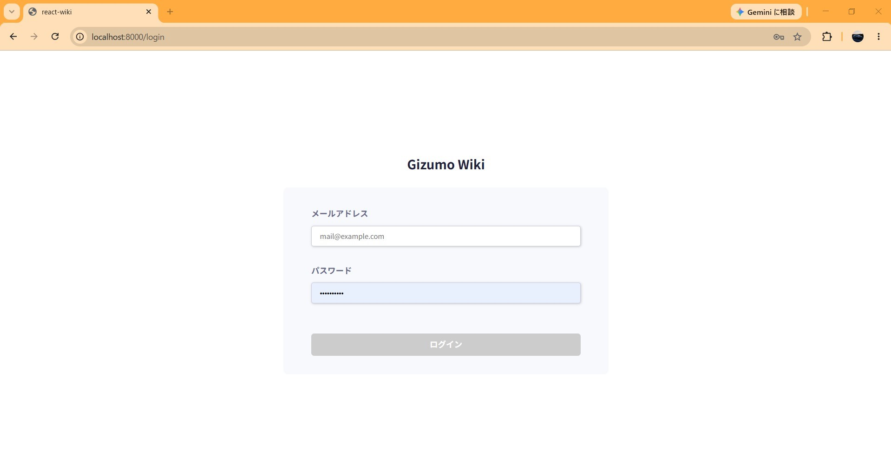
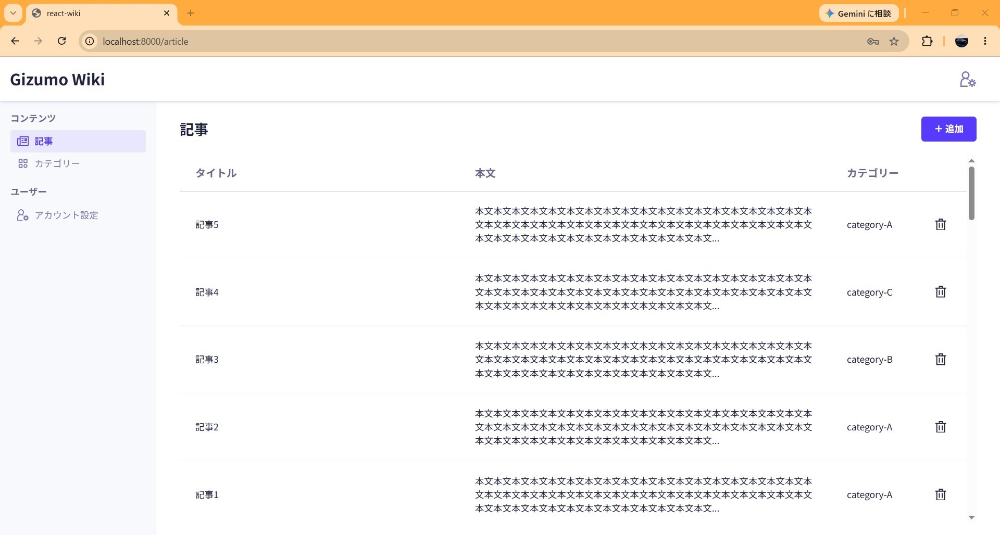
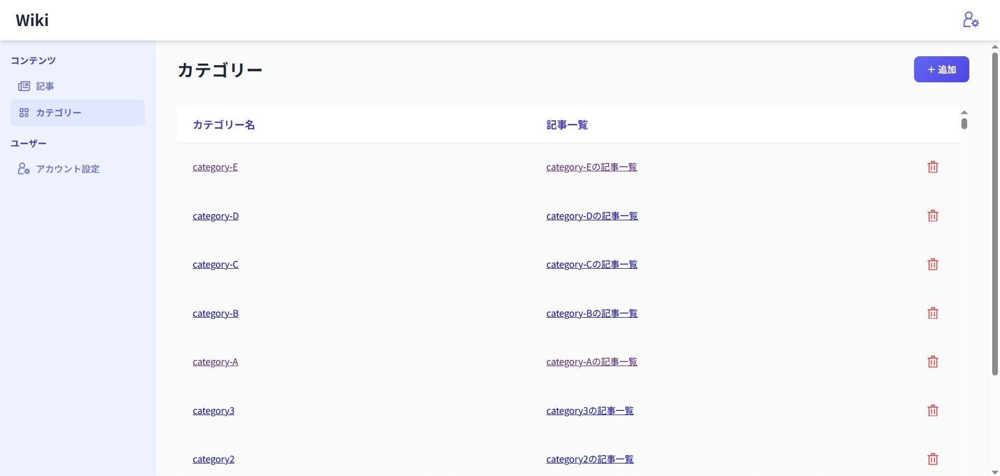
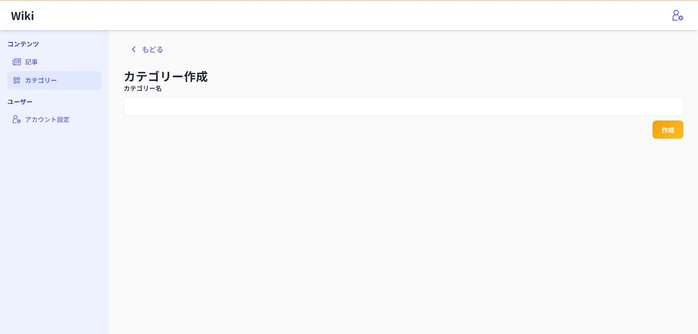
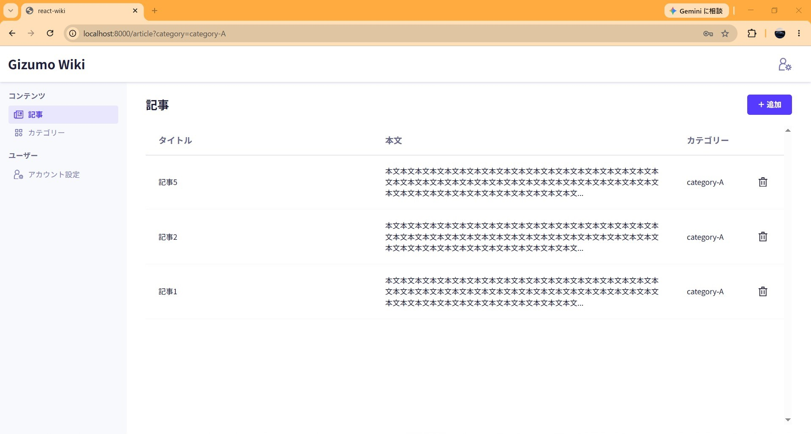

# React Wiki App

## 概要

前職のWebアプリケーション開発研修で制作した、ドキュメント管理システム（掲示板形式）のフロントエンドアプリケーションです。

Reactを用いた画面実装、状態管理、API通信、ルーティングなどを学ぶことを目的とした研修課題で、チーム開発を想定した環境で開発を行いました。

---

## 担当内容

本プロジェクトでは、カテゴリー機能の実装を担当しました。

既存の記事機能を参考にしながら、カテゴリー機能に合わせて画面遷移・API・表示内容などを変更し、以下の機能を実装しました。

- カテゴリー一覧表示
- カテゴリー作成
- カテゴリー編集
- カテゴリー削除

既存コードを読み解きながら実装を進めることで、Reactコンポーネントの構成や設計、既存実装を活用した機能追加・改修の流れについて学びました。

---
## 画面イメージ

### ログイン画面



---

### 記事一覧



---

### カテゴリー一覧



---

### カテゴリー作成



### カテゴリー別記事一覧



---
## 使用技術

- React
- JavaScript
- React Router
- Recoil
- Vite
- Zod
- Git

---
## 学んだこと

- Atomic Designを意識したコンポーネント設計
- React Routerを利用した画面遷移
- Recoilを利用した状態管理
- API通信を伴う画面実装
- Zodを利用したバリデーション
- Gitを利用したブランチ運用
- 既存コードを理解し、機能追加・改修を行う開発フロー

---

## 開発方法

```bash
npm install
npm run dev
```

※ 本アプリは研修環境のAPIサーバーを利用しているため、機能が正常に動作しない可能性があります。
画面イメージをご参照ください。

---

## 補足

本リポジトリは、前職のWebアプリケーション開発研修で制作した成果物を、ポートフォリオ提出用として整理したものです。

研修環境のAPIサーバーを利用しているため、一部機能が正常に動作しない場合があります。

提出にあたり、既知の不具合について一部修正を行い、現在動作する状態へ調整しています。